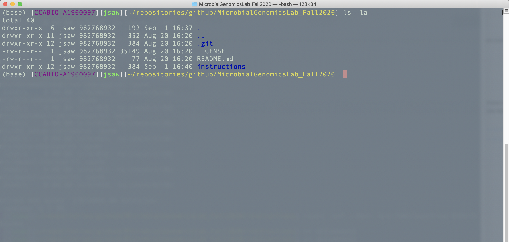

Unix and commandline environment
================================

Introduction
------------

You will be learning how to use bioinformatic tools that run in command
line environment. Part of being able to run these tools require at least
some basic knowledge of Unix (or Linux) commands. In this Wiki page, I
will explain how to use some of these commands but not all of it.

Useful list of commands
-----------------------

This website has a handy list of Unix/Linux commands you will be using
mostly.

https://files.fosswire.com/2007/08/fwunixref.pdf

I will display it below for a quick preview but you should download it
from the url listed above for your reference.

.. code:: ipython3

    from IPython.display import IFrame
    
    IFrame("https://files.fosswire.com/2007/08/fwunixref.pdf", width=800, height=800)

.. raw:: html

    
    <iframe
        width="800"
        height="800"
        src="https://files.fosswire.com/2007/08/fwunixref.pdf"
        frameborder="0"
        allowfullscreen
    ></iframe>

As you can see, it categorized commands by the type of activity such as
working with files or checking processes. Please learn these commands as
they are some of the most basic commands any bioinformaticians can use.

Basic Unix commands
-------------------

First, before you can start using these sets of commands, you must have
set up your computing environment to install basic utilities that allow
you to use these commands. Make sure you refer to the section on
“Setting up your computing environment” to make sure you have correctly
set up the environment. You will need to use a terminal or Jupyter-lab
to be able to use Unix commands.

Mac OS typically comes with a terminal application installed and you
will need to look through your list of applications. On Windows, you
will need to use the Linux Subsystem with an Ubuntu (or a different
Linux) distribution installed in order for you to use a terminal.
Terminal on Mac OS looks something like this:

   Terminal

Navigating between directories
~~~~~~~~~~~~~~~~~~~~~~~~~~~~~~

To navigate between folders, the most basic command you can use is
``cd``, which means to change directory to something. First, before you
do anything, to see where you are located, type ``pwd``. ``pwd`` stands
for print working directory. For example, if I were to type this in my
terminal (using Jupyter-lab as an interface), you would see something
like this (ignore the first line that says ``%%bash``. It is for
Jupyter-lab environment, which I will talk about a little later):

.. code:: bash

    %%bash
    cd
    pwd

.. parsed-literal::

    /Users/jsaw

First, typing the ``cd`` command without any parameters brings you to
your “Home” directory in any Unix-like environment. Here, my home
directory is “jsaw” under “Users”. If I want to navigate into a folder
under “jsaw” named “tools”, then I would type:

``cd tools``

.. code:: bash

    %%bash
    cd 
    cd tools
    pwd

.. parsed-literal::

    /Users/jsaw/tools

Now, I’m in a folder named “tools”. If I want to go back up one folder
into “jsaw”, then I would type:

``cd ..``

The two dots mean I want to go back up to a higher ranking folder than
current one.

Creating and removing directories
~~~~~~~~~~~~~~~~~~~~~~~~~~~~~~~~~

So, first thing for you to do is to navigate to your home directory and
create 4 folders named as ``tools``, ``repositories``, ``data``, and
``exercises``.

Type in your terminal:

.. code:: bash

   cd
   mkdir tools repositories data exercises
   ls

The ``mkdir`` command means “make directory” and it will create a
directory after the ``mkdir`` command.

The ``ls`` command means list the contents of a directory. When you type
this command in your home folder, you will see a bunch of folders such
as “Documents”, “Downloads”, etc, in addition to the 4 folders you have
just created. You will be using these folders for the following
purposes:

-  tools (any software tools that I might make you download and install
   prior to exercises)
-  repositories (this is where you will “clone” the course repository
   into, or any other public repositories of interest)
-  data (this is where you will store data that we will be using in the
   class)
-  exercises (this is a folder for you to do your course exercies and
   assignments)

**Warning:** Unix/Linux commands are case-sensitive, which means you
need to type exactly as shown. If you type ``Ls instead of ls``, the
command is not going to work. Next, you also want to make sure that
files and folder names do not have *any* spaces between them. This will
avoid a lot of headaches down the line. For example, if you were to
create a folder name “My Folder” by typing ``mkdir My Folder``, it will
create two separate folders named “My” and “Folder” instead of what you
have intended.

Copying, renaming, and moving files/folders
~~~~~~~~~~~~~~~~~~~~~~~~~~~~~~~~~~~~~~~~~~~

To copy one file to another location, you can type something like this:

``cp file.txt some_folder/``

And this command will copy the ``file.txt`` file into the
``some_folder`` folder. If you want to rename the ``file.txt`` into
``file2.txt``, then type:

``mv file.txt file2.txt``

You can use the same syntax to rename folders. For example if you want
to rename the ``some_folder`` into ``my_folder``, then type:

``mv some_folder my_folder``

Removing/deleting files/folders
~~~~~~~~~~~~~~~~~~~~~~~~~~~~~~~

If you want to delete a file or folder, you type something like this:

``rm file.txt``

The ``rm`` command will remove the file. To remove a directory, you can
either type ``rmdir or rm`` commands depending on whether the folder is
empty or not. If the folder is not empty (has some files in it), you
will need to type something like this:

``rm -rf non_empty_directory``

**Warning:** Be very careful with the ``rm -rf`` command. It will not
ask you for confirmation on whether you *really* want to remove
something. It will just silently carry out the task. You do not want to
accidentally remove anything important using this command. A lot of
people have learned this the hard way and they may shout and scream and
pull their hair out after realizing what they have done.

File permissions
~~~~~~~~~~~~~~~~

On a related note, you want to learn how to set permissions to files and
folders so that other people can (or cannot) read/write/excute/delete or
mess them up in anyway. For now, you are working on your own so this is
not an issue, but on servers where you work with multiple people and
groups, this is very important. If you type ``ls -la`` in your terminal,
you will see something like this:

   Terminal

Here, you will notice that files (such as “README.md”) has some funny
notations at the very beginning. These are file permissions. I have
shown below what these mean.

.. figure:: images/permissions.jpg
   :alt: Permissions

   Permissions

For example, the first character shows the type of file. If it is a
file, you will see a “-” but if it is a directory, you will see a “d”.

The ``r w and x`` following the first position mean read, write, and
execute permissions for the owner (that is you, if you created this
file). This means you have read/write/execute permissions for this file.
If you’re missing a letter and instead have an “-” means you don’t have
that permission. For example, if you want to remove the “read”
permission of a file to others beside you and group members, you type
like this:

``chmod o-r file.txt``

The ``chmod`` is the command for changing permissions. The ``o-r`` means
you are removing (a minus sign) read permissions to others ``o``. If you
want to add write permission to group members, then you type something
like this:

``chmod g+w file.txt``

The ``g+w`` means you are adding the write permission for group members.

These are some of the very basic Unix commands for you to learn for now.
We will revisit and talk more about additional commands that will become
necessary as the course progresses.
